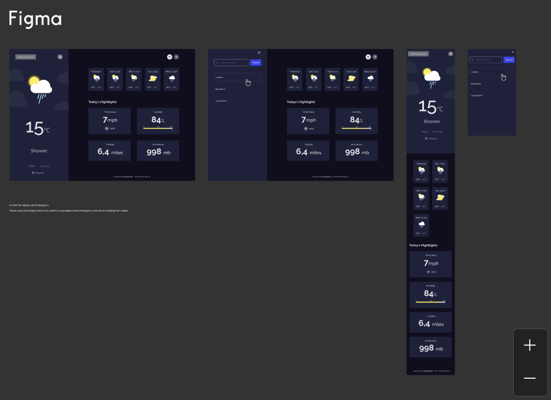

<!-- Please update value in the {}  -->

<h1 align="center">Weather App</h1>

<div align="center">
   Solution for a challenge from  <a href="http://devchallenges.io" target="_blank">Devchallenges.io</a>.
</div>

<!-- TABLE OF CONTENTS -->

## Table of Contents

- [Overview](#overview)
  - [Built With](#built-with)
- [How to use](#how-to-use)
- [Contact](#contact)

<!-- OVERVIEW -->

## Overview


Frontend challenge to create a weather app using an API and a Frontend library:

- User can see their city weather as default (using prompt for privacy reasons)
- User can see weather of today and the next 5 days
- User can see the date and location of weather
- User can see according to image for each type of weather
- User can see the min and max degree each day
- User can see wind status and wind direction
- User can see humidity percentage
- User can see a visibility indicator
- User can see air pressure
- User can set temperatures in Celsius or Fahrenheit
- User can add cities in their Search section
- User can switch to their default city by clicking on the target icon
- __Design:__ devChallenges' Figma File

- __Responsive:__ Mobile and Desktop
- __Duration:__ 2-3 days 
- __NOTE:__ _All data are stored in user's local storage, no backend_

### Built With

<!-- This section should list any major frameworks that you built your project using. Here are a few examples.-->

- [React](https://reactjs.org/)
- [Sass](https://sass-lang.com/)
- [Material Design Icons](https://google.github.io/material-design-icons/)
- [OpenWeatherMap API](https://openweathermap.org/current)


## How To Use

<!-- Example: -->

To clone and run this application, you'll need [Git](https://git-scm.com) and [Node.js](https://nodejs.org/en/download/) (which comes with [npm](http://npmjs.com)) installed on your computer. From your command line:

```bash
# Clone this repository
$ git clone git@github.com:heyitsashleyhere/Weatherapp-Devchallenge.git

# Install dependencies
$ npm install

# Run the app
$ npm start
```

## Contact

<!-- - Website [your-website.com](https://{your-web-site-link}) -->
- GitHub [@heyitsashleyhere](https://github.com/heyitsashleyhere)
- Twitter [@ashhhleyhere](https://twitter.com/ashhhleyhere)
